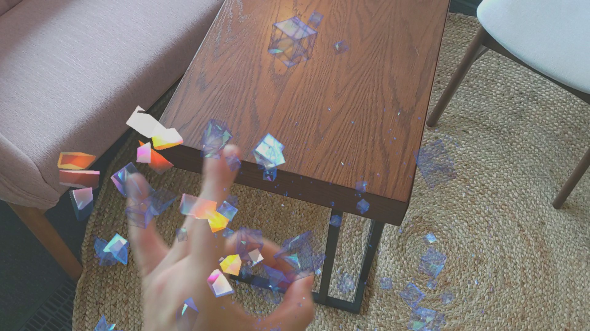
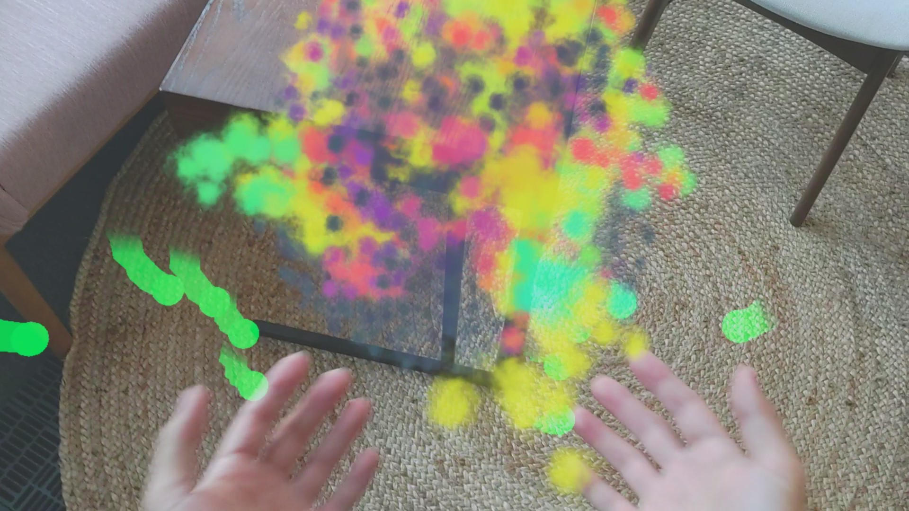
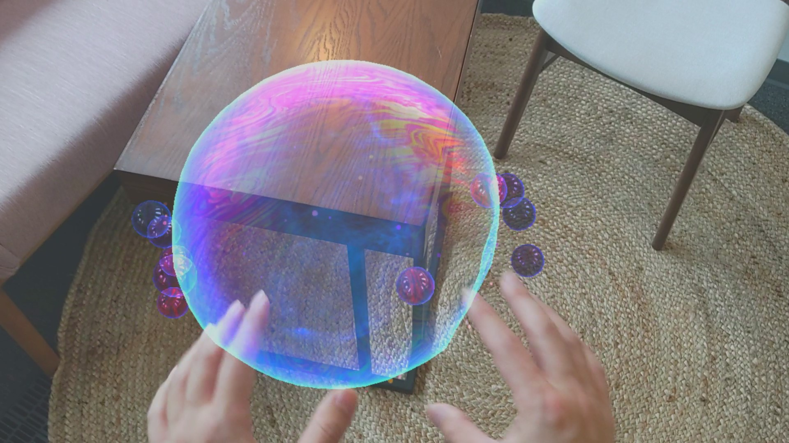
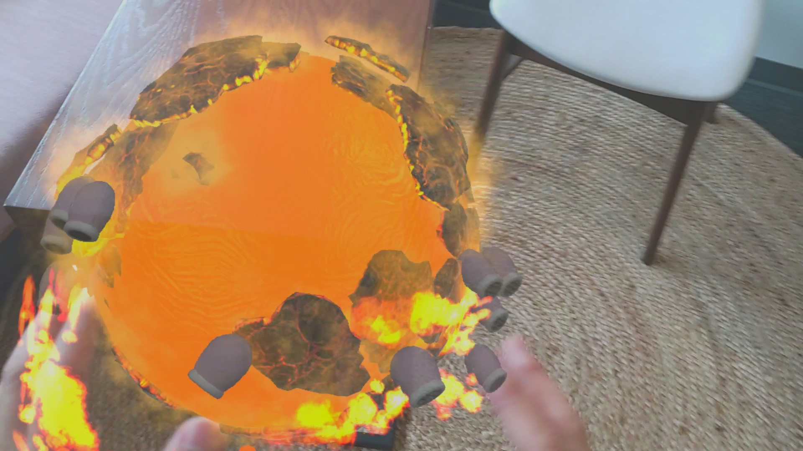
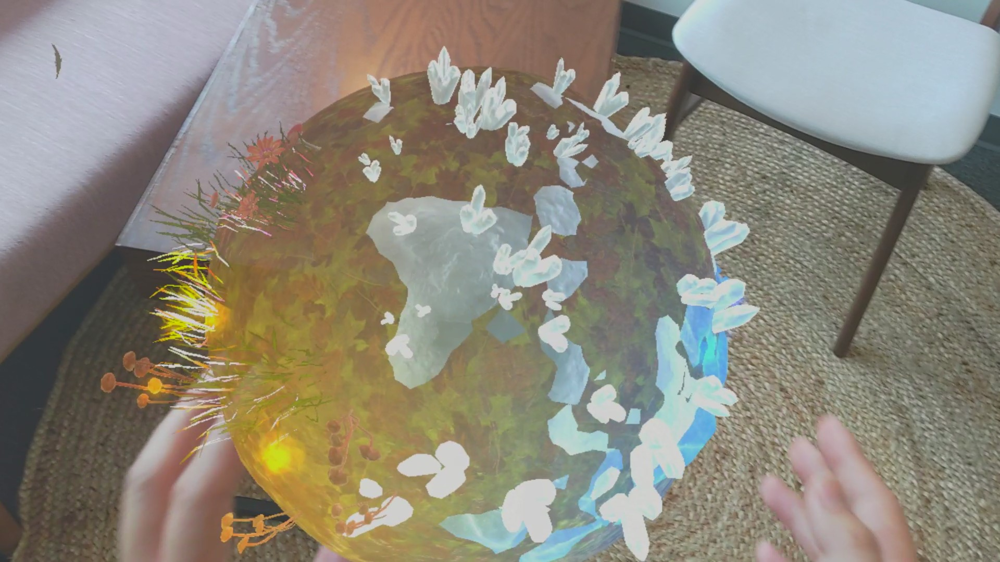

# Mixed Reality Design Labs
This repo is where Microsoft's Windows Mixed Reality Design team publishes sample apps and experiments.

# Surfaces
Surfaces is an open-source sample app from Microsoft's Mixed Reality Design Labs. It demonstrates how to use **[Mixed Reality Toolkit(MRTK)](https://github.com/Microsoft/MixedRealityToolkit-Unity)**'s input system and building blocks to create an app experience for HoloLens 2. In this project, you can find the examples of:
- Use MRTK's **[Input System](https://microsoft.github.io/MixedRealityToolkit-Unity/Documentation/Input/Overview.html)**, specifically hand / joint tracking.
- Use MRTK's **[Standard Shader](https://microsoft.github.io/MixedRealityToolkit-Unity/Documentation/README_MRTKStandardShader.html)** for performant graphics.

You can use this project's components to create your own mixed reality app experiences. 

# Supported Unity version
The current supported version of Unity is [**Unity 2019.3.x**](https://unity3d.com/unity/qa/lts-releases?version=2019.2). 

# Used MRTK version
The project is based on [**MRTK v2.1.0**](https://github.com/microsoft/MixedRealityToolkit-Unity/releases/tag/v2.1.0). 

# Supported device
- [HoloLens 2](https://www.hololens.com)

# More from Mixed Reality Design Labs #
## Sample app - Periodic Table of the Elements ##

https://github.com/Microsoft/MRDesignLabs_Unity_LunarModule

Periodic Table of the Elements is an open-source sample app from Microsoft's Mixed Reality Design Labs. It demonstrates how to use **[Mixed Reality Toolkit(MRTK)](https://github.com/Microsoft/MixedRealityToolkit-Unity)**'s input system and building blocks to create an app experience for HoloLens and Immersive headsets.

# Contributing

This project has adopted the [Microsoft Open Source Code of Conduct](https://opensource.microsoft.com/codeofconduct/). For more information see the [Code of Conduct FAQ](https://opensource.microsoft.com/codeofconduct/faq/) or contact [opencode@microsoft.com](mailto:opencode@microsoft.com) with any additional questions or comments.
